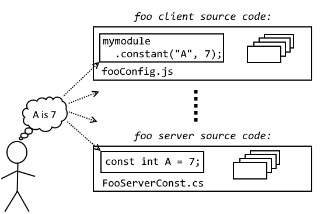

# The jsonconst suite

The jsonconst suite is a suite of tools for managing *system constants* in a *multi-platform system*.

##TL;DR
First, define your constants in a platform independent JSON file:

        {
           'authenticationServer': "auth.foobar.com"
        }

Then you (or your build script) can generate platform specific definitions using

        C:> jsonconst config.json --language c# > server\config.cs
        C:> jsonconst config.json --language typescript > admin\config.ts
        C:> jsonconst config.json --language swift > ios\config.swift
        C:> jsonconst config.json --language java > android\config.java

Jsonconst can be run in several ways

- **Command line:** To install and run ``jsonconst`` from the command line (like above), see the [jsonconst-cli package](./jsonconst-cli/README.md) 
- **Grunt:** To install and run ``jsonconst`` as a grunt task, see the [grunt-jsonconst package](./grunt-jsonconst/README.md) 
- **From NodeJS:** You can call the ``jsonconst`` library from your own code, using the [jsonconst package](./jsonconst/README.md) NPM package

The remaindeer of this document describes the background to ``jsonconst``.

## Background
As stated above, ``jsonconst`` is about managing *system constants* in a *multi-platform system*.

###What's a multi-platform system?
Here, a multi-platform system means a system using multiple development or runtime environment.

A typical example
could be a server built using Microsofts WebAPI (Visual Studio, C#, .NET, IIS hosted), clients for iOS (XCode, Swift,
deployed using AppStore) and Android (Android Studio, Java, deployed using Google Play store).

Developing multi-platform systems presents some extra challenges over single-platform systemss, primarily because 
code cannot be shared between the components.

###What are system constants?
Constants, settings and preferences are often used interchangeably.

In this context, *constants* are defined as values that cannot be changed without rebuilding and redeploying the system - 
examples could be the minimum password length or the address of the authentication server.

*System constants* are constants that affect more than one system component

In single-platform systems, constants are often defined in shared code.

*Settings* are values that can be edited by a user with 
sufficient privileges, without a need for re-building or re-deploying the system. 
Depending on the platform, system settings sometimes require a restart before
changes take effect.

*User preferences* are per-user values that are 
editable by the user. User preferences are usually edited from within the application, meaning that they take effect 
immediately, without even a restart

#### Why use constants?
*Configurability* is usually considered a good thing - who doesn't love if you can change your server log level
on-the-fly when a problem arises, without a server rebuild/redeploy/restart?

But some facts we *want* set in stone - e.g. the fact that a test-build of an app should only *ever* speak to 
the test server, *never ever* to the production server.

Choosing which values should be constants, which should be configurable, and which should be user preferences is
however ultimately a system design issue.

## The problem
In single-platform systems, system constants are often defined in shared code.

> **Example:** In a system consisting of a WCF server (.NET), and an ASP.NET web site,
> a system-wide constant ``authenticationServer`` can be defined in the ``SharedConfig.cs`` file:
>
>     namespace sharedconfig
>     {
>        public const string authenticationServer = "auth.foobar.com";
>     }
>
> Server and web site can share this definition by referencing the same version of ``SharedConfig.cs``

In multiplatform systems, however, there *is* no shared code - each platform uses different source code languages, 
different binary formats, and have different preferred config file formats.

This means that each constant has to be specified manually for each platform:

With typically dozens or hundreds of constants and a handful of platforms, inconsistencies are almost inevitable-

## The ``jsonconst`` solution
The jsonconst solution is to define the configuration *once* in a JSON file which is then *automatically compiled* into native
code for each platform.

###No inconsistencies
If the ``jsonconst`` compilation is integrated into the build process, all the constant definitions will
be identical

